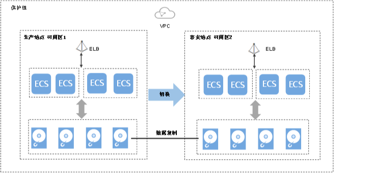

# 切换

## 操作场景

切换操作会改变保护组的容灾方向，将生产站点可用区的业务切换到容灾站点可用区，容灾站点可用区的业务切换到生产站点可用区。如[表1](#table938371263712)所示。

**表 1**  容灾方向切换

<table><thead align="left"><tr id="row12384181223713"><th class="cellrowborder" valign="top" width="33.33333333333333%" id="mcps1.2.4.1.1">
-

</th>
<th class="cellrowborder" valign="top" width="33.33333333333333%" id="mcps1.2.4.1.2">
生产站点

</th>
<th class="cellrowborder" valign="top" width="33.33333333333333%" id="mcps1.2.4.1.3">
容灾站点

</th>
</tr>
</thead>
<tbody><tr id="row53859126375"><td class="cellrowborder" valign="top" width="33.33333333333333%" headers="mcps1.2.4.1.1 ">
切换前

</td>
<td class="cellrowborder" valign="top" width="33.33333333333333%" headers="mcps1.2.4.1.2 ">
可用区1

</td>
<td class="cellrowborder" valign="top" width="33.33333333333333%" headers="mcps1.2.4.1.3 ">
可用区2

</td>
</tr>
<tr id="row16385312123720"><td class="cellrowborder" valign="top" width="33.33333333333333%" headers="mcps1.2.4.1.1 ">
切换后

</td>
<td class="cellrowborder" valign="top" width="33.33333333333333%" headers="mcps1.2.4.1.2 ">
可用区2

</td>
<td class="cellrowborder" valign="top" width="33.33333333333333%" headers="mcps1.2.4.1.3 ">
可用区1

</td>
</tr>
</tbody>
</table>

切换后数据同步不中断，容灾方向更改为从容灾站点到生产站点。您可以针对生产站点预期会出现的中断执行计划性迁移，确保不丢失任何数据。如当前生产站点可用区AZ1即将下电，您可以执行切换操作，将容灾站点可用区AZ2切换至生产站点。切换操作不会影响保护组的数据同步。

> **说明：**   
>-   切换启动前，保护组的所有云服务器必须全部处于关机状态。  
>-   切换过程中，请勿对保护组内的云服务器执行开机操作，否则可能导致保护组切换失败。  
>-   切换完成后，数据同步不会停止，只是数据同步的方向会改变。  
>-   切换完成后，保护组的状态变为“保护中”，此时需进入保护实例的详情页面将当前生产站点可用区的云服务器开机。  

**图 1**  切换  

## 切换须知

对于已安装Cloud-Init组件的Linux弹性云服务器，在首次执行切换操作前，您如果在生产站点云服务器内部修改了hostname，该修改不会自动同步到容灾站点云服务器。

为解决该问题，请参见“[切换/故障切换后，生产站点服务器与容灾站点服务器的hostname不一致](https://support.huaweicloud.com/sdrs_faq/sdrs_06_0404.html)”。

## 前提条件

-   切换前保护组的所有云服务器必须全部处于关机状态。
-   切换前保护组中必须包含复制对。
-   切换前需确保保护组已开启保护，并且保护组的状态为“保护中”或者“切换失败”。

## 操作步骤

1.  登录管理控制台。
2.  单击服务列表，选择“存储 \> 存储容灾服务”。

    进入“存储容灾服务”页面。

3.  选中待切换的保护组所在窗格中的“保护实例”，进入保护组详情页面。
4.  在保护组详情页面，单击页面右上方的“切换”。
5.  在弹出的对话框中，查看此保护组中的云服务器状态是否全部为“关机”。
    -   是，执行[6](#li812255515532)。
    -   否，勾选待关机的云服务器，并单击“关机”。

6.  在“切换”页面，单击“切换”。

    > **说明：**   
    >切换过程中，请勿对保护组内的云服务器执行开机操作，否则可能导致保护组切换失败。  

