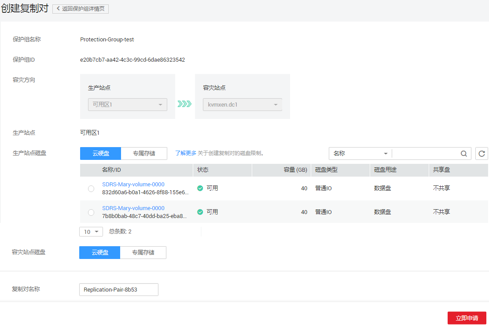

# 创建复制对

## 操作场景

您可以为需要容灾的云硬盘创建复制对，并将其添加到指定的保护组中。保护组添加复制对时：

-   如果保护组的状态为“可用”，即停止保护状态，此时，生产站点和容灾站点的云硬盘只是建立复制对关系，数据并未同步。如需数据同步，请开启保护。
-   如果保护组的状态为“保护中”，即开启保护状态，此时，新添加复制对创建成功后，会自动开启数据同步。

> **说明：**   
>复制对创建完成后，系统默认容灾站点磁盘名称与生产站点磁盘名称相同，但ID不同。  
>如果需要修改磁盘名称，请在复制对详情页面单击磁盘名称，进入磁盘详情页面进行修改。  

## 前提条件

-   保护组的状态为“可用”或者“保护中”。
-   保护组的服务器类型为ECS时，请确保用于创建复制对的云硬盘状态为“可用”。

## 操作步骤

1.  登录管理控制台。
2.  单击服务列表，选择“存储 \> 存储容灾服务”。

    进入“存储容灾服务”页面。

3.  单击待添加复制对的保护组所在窗格中的“复制对”。

    进入该保护组的详情页面。

4.  单击“复制对”页签下的“创建”。

    进入“创建复制对”页面。

    **图 1**  创建复制对  
    

5.  根据界面提示，配置复制对的基本信息，如[表1](#table14113172215131)所示。

    **表 1**  参数说明

    
    <table><thead align="left"><tr id="row711682216134"><th class="cellrowborder" valign="top" width="25.22252225222522%" id="mcps1.2.4.1.1">
参数

    </th>
    <th class="cellrowborder" valign="top" width="51.93519351935193%" id="mcps1.2.4.1.2">
参数说明

    </th>
    <th class="cellrowborder" valign="top" width="22.84228422842284%" id="mcps1.2.4.1.3">
样例

    </th>
    </tr>
    </thead>
    <tbody><tr id="row16116152218134"><td class="cellrowborder" valign="top" width="25.22252225222522%" headers="mcps1.2.4.1.1 ">
保护组名称

    </td>
    <td class="cellrowborder" valign="top" width="51.93519351935193%" headers="mcps1.2.4.1.2 ">
此参数即待创建的复制对所在的保护组的名称，此处无需填写。

    </td>
    <td class="cellrowborder" valign="top" width="22.84228422842284%" headers="mcps1.2.4.1.3 ">
Protection-Group-test

    </td>
    </tr>
    <tr id="row13973165510190"><td class="cellrowborder" valign="top" width="25.22252225222522%" headers="mcps1.2.4.1.1 ">
保护组ID

    </td>
    <td class="cellrowborder" valign="top" width="51.93519351935193%" headers="mcps1.2.4.1.2 ">
保护组ID。

    </td>
    <td class="cellrowborder" valign="top" width="22.84228422842284%" headers="mcps1.2.4.1.3 ">
619c57e9-3927-48f8-ad14-3e293260b8a0

    </td>
    </tr>
    <tr id="row2116722191312"><td class="cellrowborder" valign="top" width="25.22252225222522%" headers="mcps1.2.4.1.1 ">
容灾方向

    </td>
    <td class="cellrowborder" valign="top" width="51.93519351935193%" headers="mcps1.2.4.1.2 ">
此参数即待创建的复制对所在的保护组的容灾方向，此处无需填写。

    </td>
    <td class="cellrowborder" valign="top" width="22.84228422842284%" headers="mcps1.2.4.1.3 ">
-

    </td>
    </tr>
    <tr id="row10720384287"><td class="cellrowborder" valign="top" width="25.22252225222522%" headers="mcps1.2.4.1.1 ">
生产站点

    </td>
    <td class="cellrowborder" valign="top" width="51.93519351935193%" headers="mcps1.2.4.1.2 ">
生产站点所在的可用区。

    </td>
    <td class="cellrowborder" valign="top" width="22.84228422842284%" headers="mcps1.2.4.1.3 ">
-

    </td>
    </tr>
    <tr id="row0405151012192"><td class="cellrowborder" valign="top" width="25.22252225222522%" headers="mcps1.2.4.1.1 ">
生产站点磁盘

    </td>
    <td class="cellrowborder" valign="top" width="51.93519351935193%" headers="mcps1.2.4.1.2 ">
必选参数。

    
选择云硬盘或专属分布式存储。<ul id="ul826423812910"><li>云硬盘：EVS</li><li>专属分布式存储：DSS</li></ul>
    

    </td>
    <td class="cellrowborder" valign="top" width="22.84228422842284%" headers="mcps1.2.4.1.3 ">
云硬盘

    </td>
    </tr>
    <tr id="row1116192251313"><td class="cellrowborder" valign="top" width="25.22252225222522%" headers="mcps1.2.4.1.1 ">
容灾站点磁盘

    </td>
    <td class="cellrowborder" valign="top" width="51.93519351935193%" headers="mcps1.2.4.1.2 ">
必选参数。

    
选择云硬盘或专属分布式存储。<ul id="ul1994922181620"><li>云硬盘：EVS</li><li>专属分布式存储：DSS</li></ul>
    

    
 说明： 

根据磁盘使用的存储资源是否独享，区分为“云硬盘”和“专属分布式存储”两类。其中，专属分布式存储是为用户提供的独享存储资源。

    
容灾站点磁盘是否使用独享资源，请根据实际需求决定，不需要和生产站点磁盘保持一致。

    

    </td>
    <td class="cellrowborder" valign="top" width="22.84228422842284%" headers="mcps1.2.4.1.3 ">
云硬盘

    </td>
    </tr>
    <tr id="row530416461871"><td class="cellrowborder" valign="top" width="25.22252225222522%" headers="mcps1.2.4.1.1 ">
存储池

    </td>
    <td class="cellrowborder" valign="top" width="51.93519351935193%" headers="mcps1.2.4.1.2 "><ul id="ul148901946202715"><li>如果容灾站点磁盘选择了“云硬盘”，则无需填写“存储池”参数。</li><li>如果选择了“专属分布式存储”，则“存储池”为必选参数。</li></ul>
    </td>
    <td class="cellrowborder" valign="top" width="22.84228422842284%" headers="mcps1.2.4.1.3 ">
dss-01

    </td>
    </tr>
    <tr id="row1498954271619"><td class="cellrowborder" valign="top" width="25.22252225222522%" headers="mcps1.2.4.1.1 ">
复制对名称

    </td>
    <td class="cellrowborder" valign="top" width="51.93519351935193%" headers="mcps1.2.4.1.2 ">
必选参数。

    
您可以在创建复制对的时候定义此复制对名称，用于标识此复制对，可通过复制对名称实现对复制对的分类和搜索。

    </td>
    <td class="cellrowborder" valign="top" width="22.84228422842284%" headers="mcps1.2.4.1.3 ">
replication_001

    </td>
    </tr>
    </tbody>
    </table>

    > **说明：**   
    >当DSS开关打开时，可见“容灾站点磁盘”、“存储池”参数，否则参数不可见。  

6.  单击“立即申请”。
7.  在“规格确认”页面，您可以再次核对复制对信息。
    -   确认无误后，单击“提交”，开始创建复制对。
    -   如果还需要修改，单击“上一步”，修改参数。

8.  单击“返回保护组详情页”返回保护组详情页面，查看该保护组下的复制对列表。

    待添加的复制对状态变为“可用”或“保护中”时，表示创建成功。

