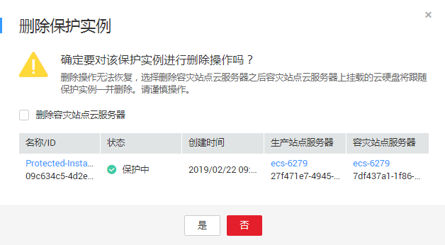

# 删除保护实例

## 操作场景

当您不再需要保护指定实例时，请执行删除保护实例操作，解除云服务器与保护组之间的保护关系。

删除保护实例不会删除生产站点的云服务器资源，对生产站点业务无影响。

## 前提条件

保护实例的状态为“可用”、“保护中”、“故障切换”、“创建失败”、“开启保护失败”、“停止保护失败”、“切换失败”、“故障切换失败”、“删除失败”、“重保护失败”、“变更规格失败”、“无效”或者“故障”。

## 操作步骤

1.  登录管理控制台。
2.  单击服务列表，选择“存储 \> 存储容灾服务”。

    进入“存储容灾服务”页面。

3.  单击待删除的保护实例的保护组所在窗格中的“保护实例”。

    进入该保护组的详情页面。

4.  在“保护实例”页签，单击待删除的保护实例所在行的操作列的“更多”，选择“删除”。

    如果需要批量删除保护实例，可同时勾选需要删除的保护实例，单击保护实例列表上方的“删除”。

    进入“删除保护实例”页面。

    **图 1**  删除保护实例  
    

5.  在“删除保护实例”页面，根据需求选择相应的操作。

    > **说明：**   
    >-   删除保护实例时如果勾选删除容灾站点云服务器，在容灾站点云服务器删除过程中，请勿对云服务器及其相关联资源进行其它操作。  

    -   删除容灾站点云服务器：
        -   不勾选：保护实例与保护组之间的保护关系解除，但是系统会保留容灾站点的云服务器、及容灾站点云服务器上挂载的云硬盘。
        -   勾选：保护实例与保护组之间的保护关系解除，并同步删除容灾站点云服务器、及容灾站点云服务器上挂载的云硬盘。

    -   释放容灾站点云服务器绑定的弹性IP地址：

        勾选“删除容灾站点云服务器”后，该参数可见。

        -   不勾选：容灾站点云服务器被删除，但是容灾站点云服务器上绑定的弹性公网IP保留，不被释放。
        -   勾选：容灾站点云服务器被删除，同时释放绑定的弹性公网IP资源。

6.  单击“是”，删除保护实例。

