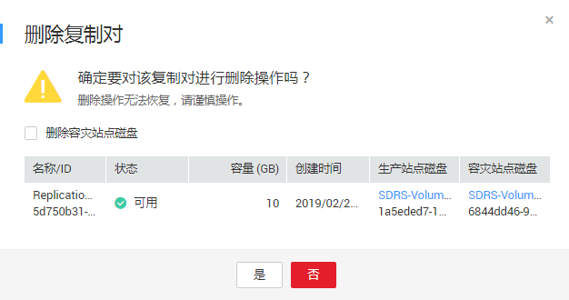

# 删除复制对

## 操作场景

当您不再需要复制对时，请删除复制对以释放资源。

删除复制对时，系统不会删除生产站点的云硬盘资源，您可以选择是否删除容灾站点的云硬盘。

## 前提条件

-   保护组状态为“可用”、“保护中”、“故障切换”、“开启保护失败”、“停止保护失败”、“切换失败”、“故障切换失败”、“删除失败”、“重保护失败”。
-   当复制对状态为“可用”、“保护中”、“故障切换”、“创建失败”、“开启保护失败”、“停止保护失败”、“切换失败”、“故障切换失败”、“删除失败”、“重保护失败”、“挂载失败”、“扩容失败”、“无效”或者“故障”。
-   该复制对未被挂载到保护实例上。如何卸载，请参见[卸载复制对](卸载复制对.md)。

## 操作步骤

1.  登录管理控制台。
2.  单击服务列表，选择“存储 \> 存储容灾服务”。

    进入“存储容灾服务”页面。

3.  单击待删除复制对所在的保护组窗格中的“复制对”。

    进入该保护组的详情页面。

4.  在“复制对”页签，单击待删除的复制对所在行的操作列的“删除”。

    进入“删除”页面。

    **图 1**  删除复制对  
    

    > **说明：**   
    >删除复制对，生产站点的云硬盘不会被删除。  

5.  在“删除”页面，根据需求选择相应的操作。

    删除容灾站点磁盘：

    -   不勾选：生产站点和容灾站点磁盘的复制对关系解除，并保留容灾站点的云硬盘。
    -   勾选：生产站点和容灾站点磁盘的复制对关系解除，并删除容灾站点的云硬盘，释放资源。

6.  确认无误后，单击“是”，删除复制对。

