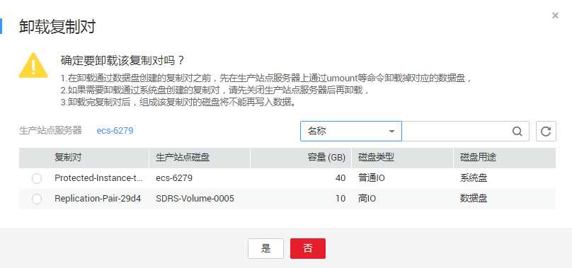

# 卸载复制对

## 操作场景

从保护实例卸载复制对。

卸载后，生产站点磁盘和容灾站点磁盘的复制对关系依然存在，但是组成该复制对的云硬盘将不能再通过云服务器写入数据。

## 前提条件

-   保护组的状态为“可用”、“保护中”、“故障切换”、“开启保护失败”、“停止保护失败”、“切换失败”、“故障切换失败”。
-   保护实例的状态为“可用”、“保护中”、“故障切换”、“开启保护失败”、“停止保护失败”、“切换失败”、“故障切换失败”、“删除失败”、“重保护失败”、“变更规格失败”、“无效”或者“故障”。
-   复制对的状态为“可用”、“保护中”、“故障切换”、“挂载失败”、“卸载失败”、“开启保护失败”、“停止保护失败”、“切换失败”、“故障切换失败”、“删除失败”、“重保护失败”、“扩容失败”、“无效”或者“故障”。
-   复制对已被挂载。
-   生产站点和容灾站点云服务器已挂载云硬盘，且云硬盘的状态为“正在使用”。

> **说明：**   
>-   系统盘是挂载在“/dev/sda”或者“/dev/vda”挂载点的云硬盘，目前支持离线卸载，即在挂载该云硬盘的服务器处于“关机”状态，才可以卸载云硬盘，运行状态的服务器需要先关机然后再卸载相应的系统盘。  
>-   当卸载数据盘时，支持离线或者在线卸载，即可在挂载该数据盘的服务器处于“关机”或“运行中”状态进行卸载。  
>    在线卸载云硬盘，详细信息请参见《弹性云服务器用户指南》中的“磁盘 \>  [在线卸载磁盘](https://support.huaweicloud.com/usermanual-ecs/zh-cn_topic_0036046828.html)”。  

## 操作步骤

1.  登录管理控制台。
2.  单击服务列表，选择“存储 \> 存储容灾服务”。

    进入“存储容灾服务”页面。

3.  单击待卸载复制对的保护实例所在窗格中的“保护实例”。

    进入该保护组的详情页面。

4.  在“保护实例”页签，单击待卸载复制对的保护实例所在行的操作列的“卸载”。

    进入“卸载复制对”页面。

    **图 1**  卸载复制对  
    

5.  在“卸载复制对”页面，选择待卸载的复制对，并单击“是”。

    复制对卸载之后，组成复制对的云硬盘将无法再通过云服务器写入数据。

