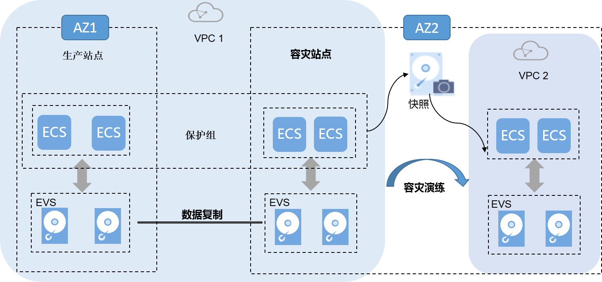
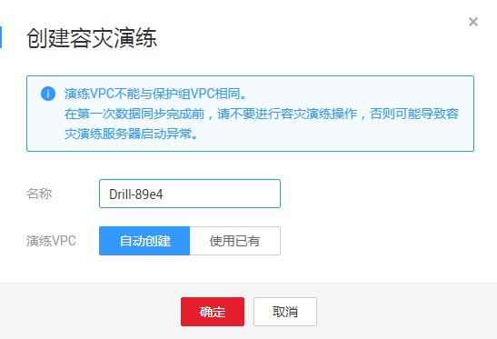

# 容灾演练

## 操作场景

在不影响业务的情况下，通过容灾演练，模拟真实故障恢复场景，制定应急恢复预案，检验容灾方案的适用性、有效性。当真实故障发生时，通过预案快速恢复，提高业务连续性。

存储容灾服务提供的容灾演练功能，在演练VPC（该VPC不能与容灾站点服务器所属VPC相同）内执行容灾演练，基于容灾站点服务器的磁盘快照，快速创建与容灾站点服务器规格、磁盘类型一致的容灾演练服务器。

> **说明：**   
>当容灾演练服务器创建完成后，生产站点服务器和容灾演练服务器同时独立运行，数据不再实时同步。  

为保证在灾难发生时，容灾切换能够正常进行，建议您定期做容灾演练，检查：

-   生产站点与容灾站点的数据能否在创建容灾演练那一刻实现实时同步。
-   执行切换操作后，容灾站点的业务是否可以正常运行。

    **图 1**  容灾演练  
    

## 使用须知

-   创建容灾演练时，如果保护组内的容灾站点服务器加入了企业项目，容灾演练创建的演练服务器不会自动加入到企业项目，如有需要请手动将演练服务器加入到企业项目。
-   创建容灾演练时，如果使用已创建好的演练VPC，在创建容灾演练后，演练VPC内子网的网络ACL规则和保护组所在VPC内子网的网络ACL规则不会保持一致，如需保持一致请手动配置。
-   创建容灾演练时，如果保护组所在VPC创建了自定义路由表并关联子网，演练VPC不会自动创建相对应的路由表，如有需要请手动创建。
-   创建容灾演练时，如果容灾站点服务器为Windows云服务器且为密钥方式登录，请确确容灾站点服务器使用的密钥对存在，否则会导致云平台无法创建容灾站演练的云服务器，从而导致创建容灾演练失败。

    > **说明：**   
    >如果容灾站点云服务器对应的密钥对已被删除，请重新创建相同名称的密钥对。  

-   创建容灾演练时，如果容灾站点服务器为Linux云服务器且为密钥方式登录，创建容灾演练后，创建的容灾演练服务器详情不显示密钥对信息，但可以使用容灾站点服务器的密钥对登录容灾演练的服务器。
-   创建容灾演练成功后，演练前的容灾站点服务器中的“主机名”、“名称”、“委托”、“云服务器组”、“自动恢复”、“安全组”和“标签”配置项修改不会再自动同步到演练服务器上。您可以登录控制台，手动将这些配置项的修改添加到演练服务器上。

## 前提条件

-   保护组的状态为“可用”、“保护中”、“故障切换”、“开启保护失败”、“停止保护失败”、“切换失败”、“重保护失败”或者“故障切换失败”。
-   在生产站点服务器与容灾站点服务器完成第一次数据同步前，请不要进行容灾演练操作，否则可能导致容灾演练服务器启动异常。

## 操作步骤

1.  登录管理控制台。
2.  单击服务列表，选择“存储 \> 存储容灾服务”。

    进入“存储容灾服务”页面。

3.  单击待添加容灾演练的保护组所在窗格中的“容灾演练”。

    进入该保护组的详情页面。

4.  在“容灾演练”页签，单击“创建容灾演练”。

    弹出“创建容灾演练”界面。

    **图 2**  创建容灾演练  
    

5.  设置“名称”和“演练VPC”。

    **表 1**  参数说明

    
    <table><thead align="left"><tr id="zh-cn_topic_0122528555_row18279121110532"><th class="cellrowborder" valign="top" width="17.001700170017003%" id="mcps1.2.4.1.1">
参数

    </th>
    <th class="cellrowborder" valign="top" width="60.33603360336033%" id="mcps1.2.4.1.2">
参数说明

    </th>
    <th class="cellrowborder" valign="top" width="22.662266226622663%" id="mcps1.2.4.1.3">
样例

    </th>
    </tr>
    </thead>
    <tbody><tr id="zh-cn_topic_0122528555_row1527915119539"><td class="cellrowborder" valign="top" width="17.001700170017003%" headers="mcps1.2.4.1.1 ">
名称

    </td>
    <td class="cellrowborder" valign="top" width="60.33603360336033%" headers="mcps1.2.4.1.2 ">
容灾演练的名称。

    </td>
    <td class="cellrowborder" valign="top" width="22.662266226622663%" headers="mcps1.2.4.1.3 ">
DR drill servername

    </td>
    </tr>
    <tr id="zh-cn_topic_0122528555_row1627921117530"><td class="cellrowborder" valign="top" width="17.001700170017003%" headers="mcps1.2.4.1.1 ">
演练VPC

    </td>
    <td class="cellrowborder" valign="top" width="60.33603360336033%" headers="mcps1.2.4.1.2 ">
该VPC用于执行容灾演练操作，不能与容灾站点服务器所属的VPC相同。包括“自动创建”和“使用已有”。

    <ul id="zh-cn_topic_0122528555_ul3372115552310"><li>自动创建：自动为保护组创建一个符合要求的演练VPC及其子网。</li><li>使用已有：使用已有VPC作为本次创建容灾演练的演练VPC。使用已有VPC时，演练VPC内子网网段和保护组所在VPC内的子网网段需保持一致。</li></ul>
    
 说明： 

演练VPC不能与保护组所属VPC相同。

    

    </td>
    <td class="cellrowborder" valign="top" width="22.662266226622663%" headers="mcps1.2.4.1.3 ">
vpc-f9f7

    </td>
    </tr>
    </tbody>
    </table>

6.  单击“确定”完成创建。

    容灾演练创建成功后，您可以登录容灾演练服务器，检查业务是否正常运行。

