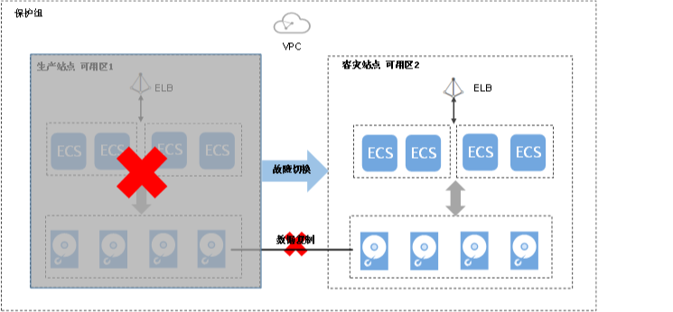

# 故障切换

## 操作场景

当生产站点可用区内的云服务器和云硬盘由于不可抗力导致物理环境故障时，可参考本章节执行故障切换操作，启用容灾站点可用区内的云服务器和云硬盘等资源，以确保业务正常运行。

如果启动故障切换，容灾站点的服务器和磁盘将立刻可用。您可上电服务器，或结合云服务器备份服务或云硬盘备份服务将数据恢复至您指定的具有应用一致性的数据恢复点。

> **说明：**   
>-   启动故障切换的同时，数据同步停止。  
>-   故障切换完成后，保护组的状态变为“故障切换”，此时需进入保护实例的详情页面将当前生产站点可用区的云服务器开机。  

**图 1**  故障切换  

## 故障切换须知

对于已安装Cloud-Init组件的Linux弹性云服务器，在首次执行故障切换操作前，您如果在生产站点云服务器内部修改了hostname，该修改不会自动同步到容灾站点云服务器。

为解决该问题，请参见“[切换/故障切换后，生产站点服务器与容灾站点服务器的hostname不一致](https://support.huaweicloud.com/sdrs_faq/sdrs_06_0404.html)”。

## 前提条件

-   请联系客服确认生产站点可用区内的云服务器等资源已经故障，且部署的服务无法正常使用，才可以开始进行故障切换。
-   故障切换前保护组中必须包含复制对。
-   故障切换前需确保保护组已开启保护，并且保护组的状态为“保护中”、“故障切换失败”或者“切换失败”。

## 操作步骤

1.  登录管理控制台。
2.  单击服务列表，选择“存储 \> 存储容灾服务”。

    进入“存储容灾服务”页面。

3.  选中待进行故障切换操作的保护组所在窗格中的“保护实例”。

    进入保护组详情页面

4.  在保护组详情页面，单击页面右上方的“更多”，选择“故障切换”。

    弹出“故障切换”对话框。

5.  在对话框中，单击“故障切换”。

    故障切换过程中，请勿对保护组内的云服务器执行开、关机操作，否则可能导致故障切换失败。

## 相关操作

-   故障切换完成后，保护组的状态变为“故障切换”，此时需进入保护实例的详情页面将当前生产站点可用区的云服务器开机。
-   故障切换完成后，保护组处于停止保护状态，您需要使用重保护功能，重新开始数据同步。详情请参见[重保护](重保护.md)。

